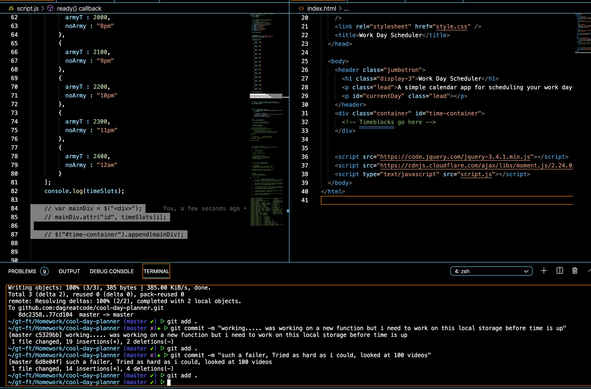

# Work Day Scheduler

<!-- https://dagreatcode.github.io/Web-APIs-Code-Quiz-gt/ -->

So I worked hard on this and still ended up getting a fail... i was going to hard code it bit i wanted to dynamically do it but i messed up big time...

In this class im starting to see why we are doing the things we are doing. We can not slow down in class because it is so much info to show.
It might not seem like i study but i have been studying since day 1. My mind want to dig deep into how things really work but i fall behind when i typw when the teacher types. 

What I found out about myself is that I need to just watch and work on my own time. At this moment I feel dumb because I am understanding whats going but i don't understand the works of a for loop. I understand but i don't how to pull info from your .js instead of hardcoding html, and putting it on the page... people have different ways but its out of my scoop and the class. I have a tutor monday so i am going to just do better... Thanks for reading...